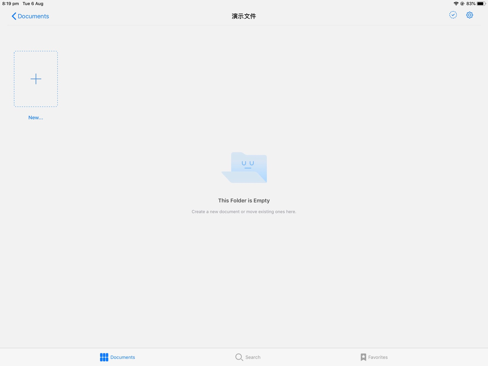
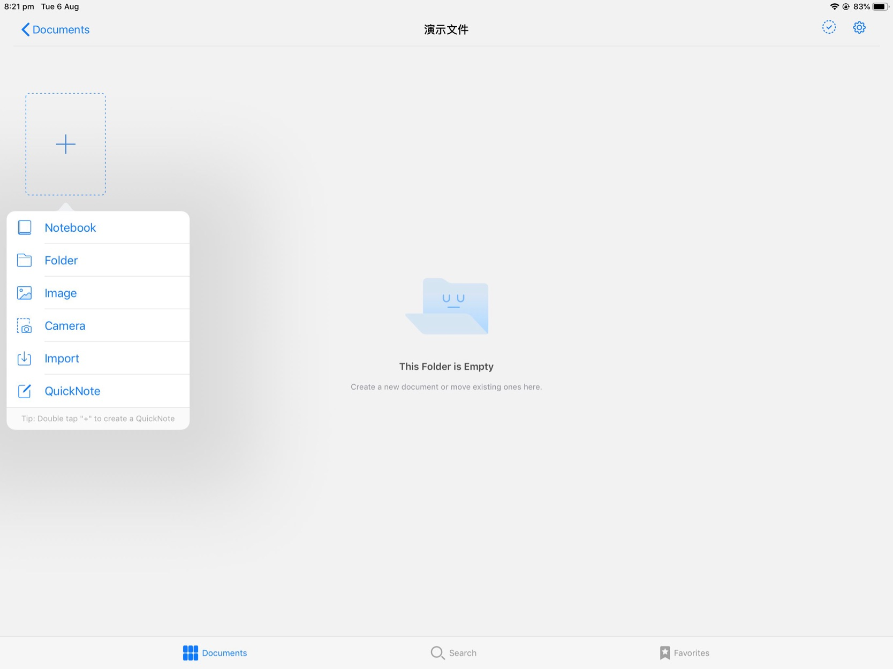
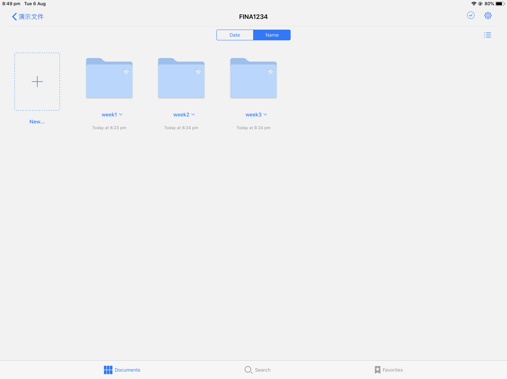
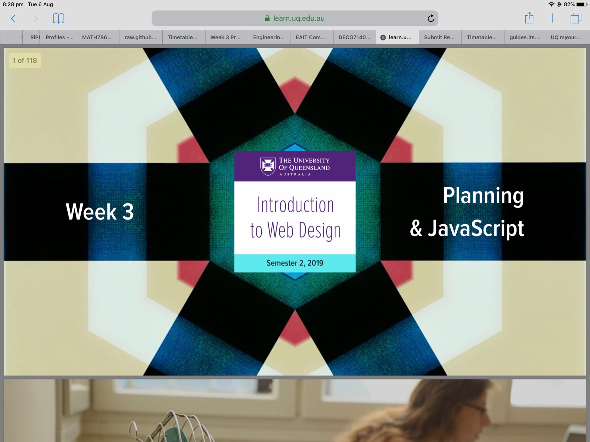
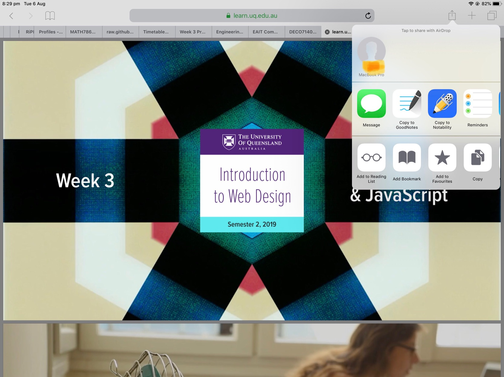
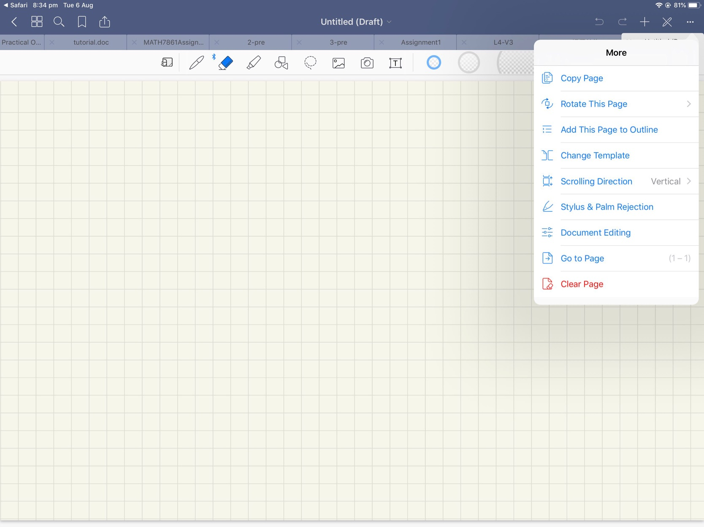
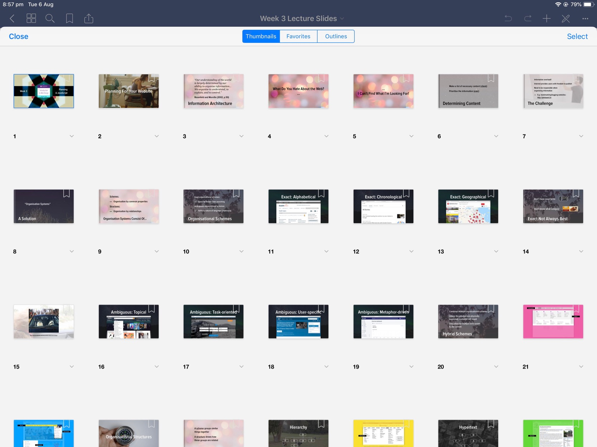

# Goodnote笔记指南

这是打开软件看到的画面

点开左侧的+号，新建一个folder，给它起一个名字：FINA1234,这就是你这门课程的名称

根据你上课的进度，一次建立文件：week1,week2,week3,...

打开week1，这就是你存放课件的地方

如何导入网上的课件？
- 在IPAD Safari浏览器打开你需要的课件 (最好是PDF格式)

- 点击右上角的分享符号，选择copy to goodnote,导入文件成功

如何记笔记？
- 右侧的+号，选择Quicknote {快捷键：双击+号} （不要选择notebook，因为我们记录笔记是以周为间隔的，篇幅不长，封面也没有必要）

- 打开Quicknote后，选择右上角的“More” (三小点)， Change Template可以选择纸张的样式，Scrolling direction选择笔记是垂直滚动还是左右滑动

- 页面往上拉，松手，生成下一页

- 左上角的正方形（大纲）能够看到笔记的每一页，点击可以直接跳转

- 上课拍照使用上方的相机按钮，建议每一页只放一道题的照片，下拉新建页面再拍下一题
 
 ## Ending~
